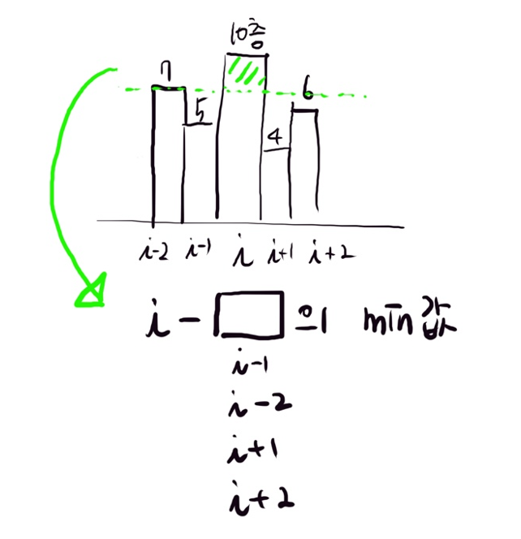

## <a href="https://swexpertacademy.com/main/code/problem/problemDetail.do" target="_blank">🗎 문제 보기 </a>

```python
for case in range(10):
    N = int(input())
    building = list(map(int, input().split()))

    anw = 0
    for i in range(2, N - 2):
        diff_l_1 = building[i] - building[i - 1]
        diff_l_2 = building[i] - building[i - 2]
        diff_r_1 = building[i] - building[i + 1]
        diff_r_2 = building[i] - building[i + 2]

        if diff_l_1 > 0 and diff_l_2 > 0 and diff_r_1 > 0 and diff_r_2 > 0:
            anw += min(diff_l_1, diff_l_2, diff_r_1, diff_r_2)

    print(f'#{case + 1} {anw}')
```

### 설명

<p align="center"></p>

- 빌딩의 높이가 list로 주어지고
- i번째 빌딩에서 오른쪽과 왼쪽 2개 범위의 빌딩 높이를 비교
  - 빌딩 높이의 차가 모두 0 이상이면 시야가 보이는 것
  - 그 차이값 중에 min 값이 시야가 보이는 층의 갯수


