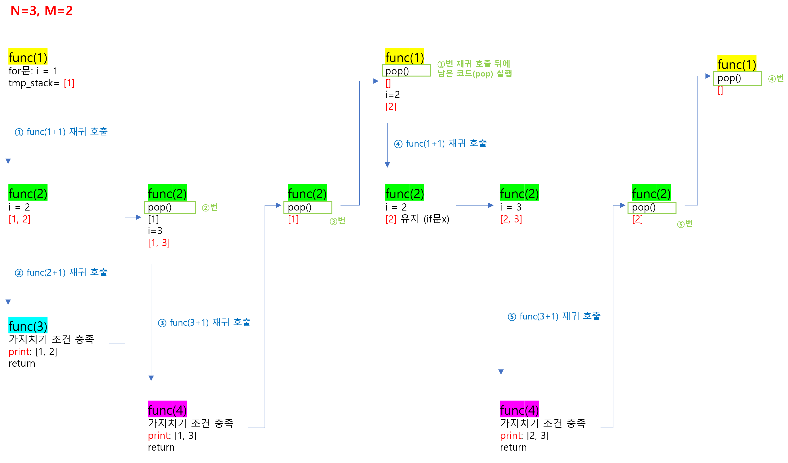

[문제보기](https://www.acmicpc.net/problem/15649)

시간 제한: 1초 (20,000,000 연산) <br/>
메모리 제한: 512MB <br/>
(1 ≤ M ≤ N ≤ 8)
## 백트레킹 (순열 구현)
### 1번 풀이 (124ms, 113MB)
```python
N, M = map(int, input().split())

tmp_stack = []


def func(start):
    # 백트래킹 가지치기(pruning)
    if len(tmp_stack) == M:
        print(' '.join(map(str, tmp_stack)))
        return

    for i in range(start, N + 1):
        if i not in tmp_stack:
            tmp_stack.append(i)
            
            func(i + 1)
            
            tmp_stack.pop()


func(1)

```
- 함수 func()에 매개변수를 주지 않으면, [1, 2], [2, 1]과 같이 모든 경우가 출력됨 (= "N과 M 1" 문제)
- **start** 매개변수 >> index
<br/><br/>
<p align="center"></p>
<br/><br/><br/>

### 3번 풀이 (160ms, 115MB)
```python
from itertools import permutations

N, M = map(int, input().split())

nums = [i for i in range(1, N + 1)]
permutated_list = permutations(nums, M)  # tuple(int) 반환

for i in permutated_list:
    print(' '.join(map(str, i)))
```
- itertools 모듈로 구현된 순열 함수 (=permutations) 사용

