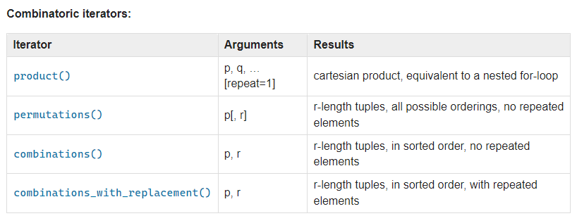

### [itertools docs](https://docs.python.org/3/library/itertools.html)

<p align="left"></p>

### 순열(permutation), 조합(combination), 중복순열(product), 중복조합(combination with replacement) 비교 코드
```python
from itertools import permutations, combinations, product, combinations_with_replacement
N, M = 4, 3

nums = [1, 2, 3, 4]
combinations_with_replacement_list = combinations_with_replacement(nums, M)

for i in permutations(nums, M):
    print(' '.join(map(str, i)))
'''
1 2 3
1 2 4
1 3 2
1 3 4
1 4 2
1 4 3
2 1 3
2 1 4
2 3 1
2 3 4
2 4 1
2 4 3
3 1 2
3 1 4
3 2 1
3 2 4
3 4 1
3 4 2
4 1 2
4 1 3
4 2 1
4 2 3
4 3 1
4 3 2
'''

for i in combinations(nums, M):
    print(' '.join(map(str, i)))
'''
1 2 3
1 2 4
1 3 4
2 3 4
'''

for i in product(nums, repeat=M):
    print(' '.join(map(str, i)))
'''
1 1 1
1 1 2
1 1 3
1 1 4
1 2 1
1 2 2
1 2 3
1 2 4
1 3 1
1 3 2
1 3 3
1 3 4
1 4 1
1 4 2
1 4 3
1 4 4
2 1 1
2 1 2
2 1 3
2 1 4
2 2 1
2 2 2
2 2 3
2 2 4
2 3 1
2 3 2
2 3 3
2 3 4
2 4 1
2 4 2
2 4 3
2 4 4
3 1 1
3 1 2
3 1 3
3 1 4
3 2 1
3 2 2
3 2 3
3 2 4
3 3 1
3 3 2
3 3 3
3 3 4
3 4 1
3 4 2
3 4 3
3 4 4
4 1 1
4 1 2
4 1 3
4 1 4
4 2 1
4 2 2
4 2 3
4 2 4
4 3 1
4 3 2
4 3 3
4 3 4
4 4 1
4 4 2
4 4 3
4 4 4
'''

for i in combinations_with_replacement(nums, M):
    print(' '.join(map(str, i)))
'''
1 1 1
1 1 2
1 1 3
1 1 4
1 2 2
1 2 3
1 2 4
1 3 3
1 3 4
1 4 4
2 2 2
2 2 3
2 2 4
2 3 3
2 3 4
2 4 4
3 3 3
3 3 4
3 4 4
4 4 4
'''
```